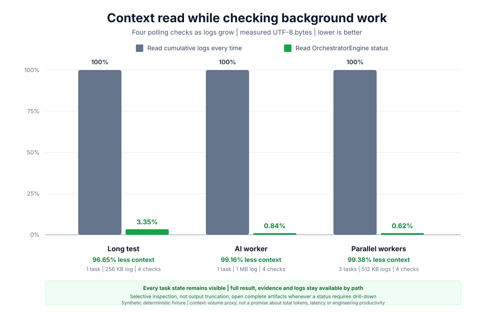

# OrchestratorEngine

[](https://github.com/Jafa7/OrchestratorEngine/actions/workflows/ci.yml)
[](LICENSE)
[](pyproject.toml)
[](https://github.com/astral-sh/ruff)
[](https://github.com/Jafa7/OrchestratorEngine/releases/latest)

Local event-driven coordination for AI agents and detached CLI workers:
durable results and evidence, compact status checks, and host-specific
completion delivery without engine-managed provider API keys.

OrchestratorEngine is a small event-driven coordination layer for AI worker
processes. A user orchestrates from a host chat (Claude Code / Claude for
Windows, VS Code Copilot, or Codex Desktop), dispatches tasks to CLI workers,
and ends the turn. Workers run
detached, write a terminal event to disk when they finish, and a local watcher
routes the completion through the dispatching host's configured delivery
channel — without engine-managed provider API keys or token-spending heartbeat
prompts. Host and worker CLIs retain responsibility for their own local
authentication.

Supported host/worker combinations are symmetric: any host chat can manage any
CLI workers (Claude, Codex, Copilot, or any other command-line worker).
Long verification runs can use the same flow: run checks detached, keep full
logs as artifacts, and return a compact pass/fail summary through that channel.
GitHub Actions runs can also be monitored by exact run ID through the local
authenticated `gh` CLI, so CI completion can resume the dispatching chat
without model polling or engine-managed GitHub credentials.

Host delivery quality is provider-specific. Claude uses its watched session
stream, VS Code uses its chat CLI, and current Codex Desktop releases use
`codex queue` to submit the bounded follow-up to the dispatching live task.
Codex installations without that command retain the older durable headless
App Server fallback. Codex is also fully supported as a CLI worker through
`codex exec`.

Codex can also resume automatically **within an already-active turn** by
blocking once on deterministic worker state. The cheapest path is a direct
`worker wait --json`; an optional low-cost relay subagent is only a host-control
bridge when native agent waiting is more reliable than a direct command wait.
This is complementary to detached live queue delivery. See
[Codex in-turn continuation](docs/codex-in-turn-continuation.md).
Parallel workers can share the same deterministic wait by repeating
`--task-id` and selecting `--mode all` or `--mode any`.

## Measured coordination context reduction

The graph below shows one practical benefit independent of the host delivery
mechanism: status checks can read compact task state instead of repeatedly
loading growing worker logs. Lower is better.



| Scenario | Full-log polling | Status reads | Context read | Reduction |
| --- | ---: | ---: | ---: | ---: |
| Long test | 655.4 KB | 17.4 KB | 2.65% | 97.35% |
| AI worker | 2.62 MB | 17.4 KB | 0.66% | 99.34% |
| Three parallel workers | 3.93 MB | 19.9 KB | 0.51% | 99.49% |

This is selective inspection, not output truncation. The status report keeps
task states, diagnostics, log sizes and paths compact; complete stdout,
stderr, result and evidence artifacts remain available for targeted or full
reading when needed.

The measurement uses four checks against deterministic growing logs and UTF-8
bytes as a provider-neutral proxy for context volume. It does not claim the
same percentage of total token or engineering cost for every workflow. Codex
agents can avoid those intermediate model calls by handing `worker wait` to
the user's terminal or by using one bounded in-turn wait when the task is short
enough; detached live wakeup avoids the manual return step as well.
See the reproducible
[measurement methodology](docs/coordination-efficiency.md).

## Quick start

### Agent-assisted setup (recommended)

Paste this into the chat that will orchestrate the adopting project:

```text
Connect OrchestratorEngine to this project.
Repository: https://github.com/Jafa7/OrchestratorEngine
Read docs/setup-guide.md in that repository and follow it exactly.
I orchestrate from this chat; ask me anything the guide says to ask.
```

An AI agent should treat the [setup guide](docs/setup-guide.md) as the
canonical procedure. It contains host-specific branches, checks after each
step, strict-admission examples and troubleshooting. The shorter sequence
below is only a human-readable preview.

### Manual preview

Install an immutable release, scaffold the project and bind the host chat:

```bash
python -m pip install \
  "orchestrator-engine @ git+https://github.com/Jafa7/OrchestratorEngine.git@v0.8.1"
orchestrator-engine --project-root /path/to/project adopt --host HOST
orchestrator-engine --project-root /path/to/project bind --host HOST
```

Replace `HOST` with `codex`, `claude` or `vscode` and run `bind` from the chat
that should own completions.

Edit the generated `.orchestrator/workers.toml`, enabling only profiles whose
CLI, model and non-interactive permission strategy have been verified. The
complete catalog is [examples/workers.toml](examples/workers.toml).

```bash
orchestrator-engine --project-root /path/to/project worker diagnose --enabled-only
```

Choose verification breadth before dispatch and record it in task intent:

```bash
printf '%s\n' 'Perform the bounded smoke task.' > /tmp/orchestrator-smoke.md
cat > /tmp/orchestrator-smoke-intent.json <<'JSON'
{
  "role": "implementation",
  "risk": "low",
  "verification": "structural",
  "permissions": "restricted",
  "authorizations": {
    "commit": false,
    "push": false,
    "network": false
  }
}
JSON
orchestrator-engine --project-root /path/to/project worker run \
  --worker WORKER --task-id SMOKE-1 \
  --prompt-file /tmp/orchestrator-smoke.md \
  --intent-file /tmp/orchestrator-smoke-intent.json
```

Start the host-specific delivery channel described in
[docs/hosts.md](docs/hosts.md). Claude uses `watcher stream`; VS Code and Codex
Desktop use host-scoped callback services. Codex requires a CLI whose help
exposes `codex queue`; older versions use the documented durable fallback.
Finish with:

```bash
orchestrator-engine --project-root /path/to/project status
```

## Goals

- Run workers detached from the active orchestrator turn.
- Store terminal events and inbox signals as durable JSON files.
- Route a bounded pointer to event/evidence/result through the bound host
  channel.
- Avoid token-spending heartbeat prompts.
- Keep provider integrations at explicit adapter boundaries.
- Provide service-style watcher control: start, status, stop and restart.
- Monitor allowlisted external checks locally and wake only on configured
  terminal outcomes.

## Non-goals

- This is not an AI agent runtime.
- This does not own product-specific task contracts.
- This does not replace Codex, Claude, Copilot or project-local review logic.
- This does not manage provider API keys or call provider APIs directly; local
  host and worker CLIs own their authentication.

## How it fits together

1. **Bind** the project to the host chat once
   (`bind --host codex|claude|vscode`).
2. **Dispatch** tasks from the host chat (`worker run`), which returns
   immediately; a detached supervisor runs the worker CLI and emits a terminal
   event on exit.
3. **Deliver**: a watcher service (`--action callback`) sends a follow-up to
   VS Code or the bound Codex Desktop task, while Claude watches
   `watcher stream`. Callback services can be scoped by host so
   multiple host channels can share one inbox without consuming each other's
   signals.

Deterministic sources can use the same delivery path. For example, `ci watch`
runs a detached GitHub Actions monitor, writes a verification result, and emits
a provider-neutral follow-up signal when its wake policy requires one. The
watcher does not interpret CI logs and no model is used while waiting. Monitor
status is compact; `ci reap` safely finalizes a monitor only when its recorded
supervisor identity is proven gone.

`pr watch` provides the corresponding pull-request readiness boundary. It
requires the exact PR number and full expected head SHA, optionally requires an
approved review decision, and wakes the dispatching chat only after a terminal
readiness outcome. Checks, reviews, draft state, merge conflicts, head changes,
closure and transport failures are classified without model polling. It uses
the same adopter-installed `gh` prerequisite and repository allowlist as
`ci watch`.

Local suites can use `check plan` and `check run`. The planner fingerprints
the declared argv/cwd contract and uses a configured estimate or the median of
up to ten successful runs. In `auto` mode, estimates over 30 seconds and
unknown `full` gates run detached; known short checks stay foreground. Passing
output remains in durable logs while compact result metadata retains its size
and SHA-256 instead of copying the log into chat.

An agent can also record an explicit bounded phase checkpoint. A
`workstream checkpoint --decision continue --ready` signal is delivered after
its configured delay; `needs_user`, `waiting_external`, `blocked`, `complete`
and `paused` never wake the chat automatically. Ending a turn by itself is not
continuation authorization. See
[docs/workstream-continuation.md](docs/workstream-continuation.md).

Per-host setup details: [docs/hosts.md](docs/hosts.md).

Release and upgrade notes:
[CHANGELOG.md](CHANGELOG.md), [LICENSE](LICENSE), and
[docs/upgrade-guide.md](docs/upgrade-guide.md). Adopting projects should use
the [agent-ready upgrade checklist](docs/adopter-upgrade-checklist.md) after
installing an immutable release.

## File layout inside an adopted project

By default the orchestrator and adopting agents use `.orchestrator/` in the
target project:

```text
.orchestrator/
  workers.toml
  integrations.toml
  policies/
    quality-efficient.md
  prompts/
    <prompt>.md
  task-resolutions/
    <task_id>.json
  artifact-resolutions/
    <path-and-content-identity>.json
  events/
    <event_id>.json
  tasks/
    <task_id>/
      task.json
      effective-prompt.md
      worker-stdout.log
      worker-stderr.log
      result.json
      evidence.json
      supervisor.log
  checks/
    <check_id>/
      check.json
      evidence.json
      verification-result.json
      summary.txt
      full.log
      <command-label>.log
  check-history.json
  monitors/
    github-actions/
      <monitor_id>/
        monitor.json
        supervisor-launch.json
        evidence.json
        full.log
        supervisor.log
        cancel-request.json  # only after an operator cancellation request
  workstreams/
    <workstream_id>/
      workstream.json
      checkpoints/
        <checkpoint_id>.json
        <checkpoint_id>.result.json
        <checkpoint_id>.evidence.json
  inbox/
    binding.json
    signals/
      <event_id>.json
    notifications/
      <event_id>.json
    thread-wakeups/
      <event_id>.json
    acknowledgements/
      <host>/
        <event_id>.json
    logs/
      watcher-service.log
    watcher-state.json
    watcher-service.json
    watcher-heartbeat.json
    watcher-<host>-callback-state.json
    watcher-<host>-callback-service.json
    watcher-<host>-callback-heartbeat.json
    watcher-claude-stream-state.json
```

The core package is project-neutral. A project may wrap it and choose a
different state directory, but the directory must still follow the
OrchestratorEngine contract. Product-specific legacy layouts should be adapted
by the product, not by OrchestratorEngine core.

## Operations and recovery

Optional concurrency, availability, intent and recovery controls stay
deterministic and local. Limits live in `workers.toml`; operator actions are
explicit:

```bash
orchestrator-engine --project-root /path/to/project worker queue tick
orchestrator-engine --project-root /path/to/project worker cancel \
  --task-id TASK-001 --mode graceful --reason "superseded"
orchestrator-engine --project-root /path/to/project worker retry \
  --task-id TASK-001 --max-attempts 3 --reason "provider quota reset"
orchestrator-engine --project-root /path/to/project status --since CURSOR
```

Exact active duplicates are blocked by default. Structured worker handoffs and
usage telemetry are optional evidence; neither can instruct core control flow.
Complete file deliverables belong below the task-local declared `outputs/`
directory and are hashed into `worker-outputs.json`; provider-owned plan/cache
files are deliberately not treated as durable results.

Check health / list pending signals / stop:

```bash
orchestrator-engine --project-root /path/to/project status
orchestrator-engine --project-root /path/to/project doctor
orchestrator-engine --project-root /path/to/project worker tasks --severity warning
orchestrator-engine --project-root /path/to/project watcher \
  --host vscode service status
orchestrator-engine --project-root /path/to/project inbox
orchestrator-engine --project-root /path/to/project watcher \
  --host vscode service stop
```

Use `status` first for a compact operator report. It summarizes `doctor`,
the active delivery channel, worker task diagnostics and verification checks,
then lists only issues and problem tasks/checks that need follow-up.

If a failed historical worker task has been handled manually or superseded by a
successful rerun, keep the task artifacts and add an operator resolution:

```bash
orchestrator-engine --project-root /path/to/project worker resolve \
  --task-id TASK-OLD \
  --status superseded \
  --superseded-by-task-id TASK-NEW \
  --reason "Successful rerun completed the intended work."
```

The resolution lives in `.orchestrator/task-resolutions/`. It stops normal
warning-level status reports from reopening the handled failure, while
`worker tasks --severity info` still shows the historical outcome.

A completed task can acknowledge one verified non-error diagnostic without
hiding the task or its evidence. Pass the exact diagnostic code, for example:

```bash
orchestrator-engine --project-root /path/to/project worker resolve \
  --task-id TASK-PLAN --status acknowledged \
  --diagnostic-code claude_plan_output_may_be_external \
  --reason "Complete durable output inspected."
```

The diagnostic remains visible as `info`; error diagnostics cannot be
downgraded by an acknowledgement.

Historical malformed schema metadata can be acknowledged without editing the
artifact. `artifact resolve --path PATH --reason TEXT` writes an immutable
companion record bound to the exact path and SHA-256. Changed bytes, unreadable
JSON and real unsupported schema versions remain visible to `doctor`.

When an adopter project finds an orchestration issue, draft a structured report
instead of pasting huge logs:

```bash
orchestrator-engine --project-root /path/to/project \
  report draft --project-name PROJECT > /tmp/orchestrator-report.md
```

See [docs/operator-reporting.md](docs/operator-reporting.md).
Reports are normally authored by the GitHub account/token that creates the
issue; use `project:*` and `source:*` labels to identify the adopter project
and host chat.

For a Claude host there is no push service; arm a watch from the Claude chat
on:

```bash
orchestrator-engine --project-root /path/to/project watcher stream
```

Manual event emission (for project-side supervisors that run workers
themselves):

```bash
orchestrator-engine --project-root /path/to/project emit \
  --task-id TASK-001 \
  --terminal-status completed \
  --result /path/to/project/result.json \
  --evidence /path/to/project/evidence.json
```

For long checks, use the verification result contract documented in
[docs/contracts.md](docs/contracts.md#verification-result). The portable
reference runner is [examples/check_runner.py](examples/check_runner.py), and
the first-class runtime uses `check plan/run/status/reap`. Use the legacy-compatible
`checks` reader to inspect compact verification results before opening logs.

```bash
orchestrator-engine --project-root /path/to/project check plan --suite full
orchestrator-engine --project-root /path/to/project check run \
  --check-id FINAL-1 --suite full
```

Optional host, worker and integration CLIs are adopter-installed tools. See
[docs/external-tools.md](docs/external-tools.md) for the feature matrix and
verification commands. In particular, `ci watch` requires an authenticated
GitHub CLI (`gh`); the engine never installs it or manages its credentials.

`worker diagnose` also compares the bundled `quality-efficient` policy hash
with the selected project-local copy. It reports differences for explicit
review but never overwrites adopter policy.

For AI review, implementation, verification and adopter-report workers, start
from the reusable prompt templates in [examples/prompts](examples/prompts).
They keep worker output compact: summaries and artifact paths first, full logs
only as durable files, and small excerpts only when a failure needs context.
`worker tasks` also reports `task_large_worker_log` when stdout/stderr or the
supervisor log is large enough that a host chat should avoid reading it whole.

Prune stale notifications, thread-wakeup receipts and rotate the watcher
service log:

```bash
orchestrator-engine --project-root /path/to/project cleanup
```

`cleanup` only removes ephemeral watcher output (notifications,
thread-wakeup receipts, non-current log files) older than
`--retention-days` (default 30) and compacts `watcher-service.log` once it
exceeds `--log-max-bytes`. Terminal events and inbox signals are never
removed by `cleanup`; they are the durable audit trail and are the
responsibility of the adopting project to retire.

## Follow-up message contract

A terminal event produces a short deterministic follow-up message. Depending
on the bound host, it is queued to the live Codex task, sent to VS Code chat,
or emitted as a JSON stream line for Claude. Older Codex CLIs fall back to a
headless App Server turn stored in thread history.

```text
LOCAL_AI_ORCHESTRATOR_WAKEUP v1
project: /path/to/project
event_id: ...
task_id: ...
terminal_status: completed
event: ...
evidence: ...
result: ...
requires: ORCHESTRATOR_FOLLOWUP

Read the event/evidence. Verify state and decide the next safe action.
If review is required, inspect the real diff and checks before accepting.
Do not commit or push unless the user explicitly requested it.
```

## Development

Use the [risk-based verification policy](docs/verification-policy.md): prose
and metadata-only edits get structural checks, isolated behavior gets focused
tests, and shared contracts, packaging or release candidates get the full gate.
Do not repeat a passing full gate after a later prose-only edit.

```bash
python -m pip install '.[test]'
python -m unittest discover -s tests -p 'test_*.py'
ruff check .
```

The test suite includes an install smoke test that creates a temporary virtual
environment, installs the package with `pip install .`, and verifies the CLI,
worker supervisor and stream watcher without `PYTHONPATH`.

Additional documentation:

- [Contributing and adopter-neutral public content](CONTRIBUTING.md)
- [Setup guide (start here)](docs/setup-guide.md)
- [Contracts](docs/contracts.md)
- [Host setup](docs/hosts.md)
- [Codex in-turn continuation](docs/codex-in-turn-continuation.md)
- [Worker behavior policies](docs/worker-policies.md)
- [Adopter upgrade checklist](docs/adopter-upgrade-checklist.md)
- [Project integration and legacy adoption](docs/project-adoption.md)

## License

OrchestratorEngine is available under the permissive [MIT License](LICENSE).
Copyright remains with Oleg Synelnykov (Jafa7); copies or substantial portions
must retain the copyright and license notice.
