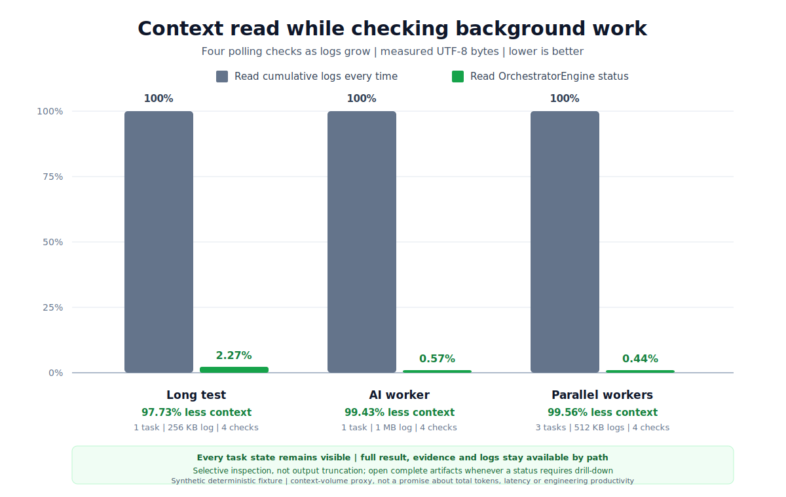

# Coordination context measurement

This measurement answers one narrow question:

> While background work produces growing logs, how many UTF-8 bytes must a
> host chat read to check task state four times?

It does not measure total provider token use, model reasoning quality,
execution latency or total engineering productivity.

## Selective inspection contract

Context reduction does not mean that OrchestratorEngine truncates or deletes
worker output. The measured status path follows these rules:

- every task remains counted and its current state remains visible;
- the terminal state is visible on the final check;
- large-log sizes and paths are exposed without embedding log bodies;
- complete stdout, stderr, result and evidence artifacts remain on disk;
- an agent can open a targeted artifact or the complete log when needed.

The benchmark rejects a scenario if a task or current state disappears, a
terminal task is not reported as completed, or a full log/result/evidence
artifact is no longer available.

## Metric

The measurement uses UTF-8 response bytes because they are deterministic and
provider-neutral:

```text
context share = status report bytes / naive polling bytes
context reduction = 1 - context share
```

Actual token counts vary by model, tokenizer, tool protocol and host. UTF-8
bytes are a stable proxy for context volume, not a token-count promise.

## Baseline

Each scenario has four checkpoints at 25%, 50%, 75% and 100% of its final log
size. The deliberately simple baseline reads every cumulative worker stdout
log in full at every checkpoint.

The OrchestratorEngine path reads the complete pretty-printed JSON output of
`orchestrator-engine status` at the same four checkpoints. The status report
is not stripped down for the benchmark: it includes doctor, host capability,
worker profile, task and check summaries produced by the public command.
The harness pins the package-install health check to a healthy installed
v0.2.0 engine, replaces the temporary project root with
`/benchmark/project`, and fixes generated timestamps before counting bytes so
the result does not depend on checkout location or installation style.

This is a comparison with naive repeated log reads, not with every possible
manual tailing, IDE or log-analysis workflow.

## Fixture

The public deterministic fixture uses successful tasks and synthetic ASCII
logs. It invokes no AI model, provider API or private project data.

| Scenario | Tasks | Final log volume | Polls |
| --- | ---: | ---: | ---: |
| Long test | 1 | 256 KB | 4 |
| AI worker | 1 | 1 MB | 4 |
| Parallel workers | 3 | 3 x 512 KB | 4 |

Run it from a source checkout:

```bash
PYTHONPATH=src python3 benchmarks/coordination_context.py \
  --write-svg docs/assets/coordination-context.svg \
  > docs/assets/coordination-context.json
```

The generated JSON is the machine-readable result behind the checked-in SVG.

## Results



| Scenario | Naive polling | Status reads | Context share | Reduction |
| --- | ---: | ---: | ---: | ---: |
| Long test | 655,360 B | 17,911 B | 2.73% | 97.27% |
| AI worker | 2,621,440 B | 17,913 B | 0.68% | 99.32% |
| Parallel workers | 3,932,160 B | 20,500 B | 0.52% | 99.48% |

Every scenario passed the selective-inspection quality guard. The smaller
status reads come from carrying task state, diagnostics, sizes and artifact
paths instead of repeatedly embedding cumulative log bodies.

## Codex Desktop interpretation

Codex Desktop on Windows does not currently provide reliable live wakeup for
an already-open chat. This benchmark measures the useful optimization that
remains when an agent does check state: each check can read a bounded status
report instead of cumulative logs. The preferred manual fallback is now
`worker wait`: it performs those filesystem checks outside the model, updates
one terminal line and tells the user when to return to the chat.

The graph does not claim that `worker wait` creates Codex live wakeup. It
eliminates intermediate model calls while the user still returns to the chat
manually. Claude's live stream also avoids that manual return step, but that
additional benefit is outside this four-check comparison.

## Limitations

- Successful tasks normally need no log drill-down. A failure investigation
  that reads targeted excerpts or a full log consumes additional context.
- Larger status diagnostics or smaller worker logs reduce the percentage
  savings; larger or parallel logs increase it.
- The fixture does not include initial prompts, worker model output, final AI
  review, tool-call envelopes or host UI overhead.
- The three percentages are measured snapshots for these fixtures, not a
  universal forecast for every project or workflow.
